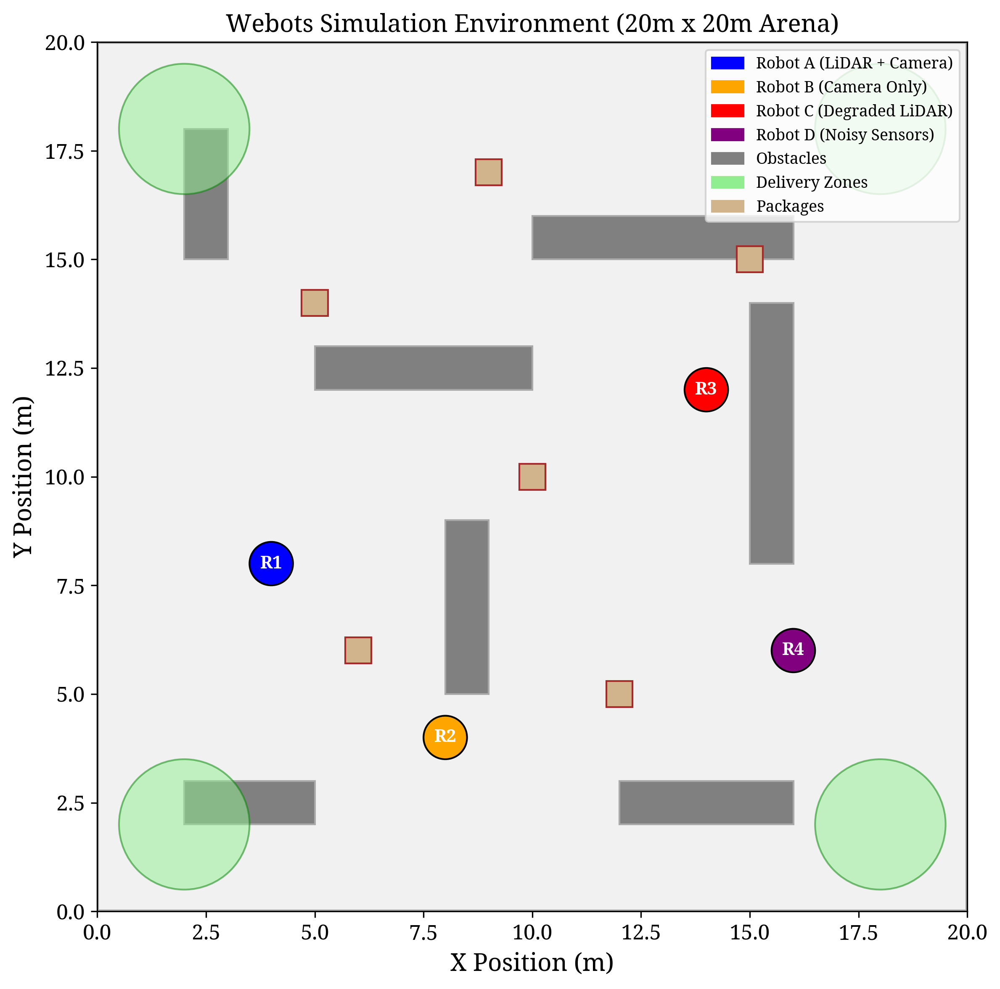

# DC-Ada: Data-Centric Collaborative Adaptation for Multi-Robot Systems

[](https://www.python.org/downloads/)
[](https://opensource.org/licenses/MIT)
[](https://arxiv.org/)

Official implementation of **"Data-Centric Collaborative Adaptation for Multi-Robot Systems with Asymmetric Environmental Knowledge"**.

## Overview

DC-Ada is a **communication-minimal** framework for adapting heterogeneous multi-robot teams to new environments. Instead of fine-tuning policy parameters (which requires expensive gradient computation and high-bandwidth communication), DC-Ada learns lightweight **data transformation layers** that adapt each robot's sensor observations to work optimally with a frozen shared policy.

<p align="center">
  
</p>

### Key Features

- **Communication-Minimal**: Only broadcasts a single scalar (team reward) per episode (~0.133 bytes/sec)
- **Gradient-Free**: Uses zeroth-order optimization, enabling adaptation on robots without autodiff capabilities
- **Heterogeneous Sensors**: Handles robots with different sensor configurations (LiDAR, camera, degraded sensors)
- **Theoretical Guarantees**: Provably non-decreasing expected reward under mild Lipschitz assumptions

## Installation

### Requirements

- Python 3.8+
- PyTorch 1.9+
- NumPy
- Gymnasium
- Matplotlib (for visualization)
- tqdm

### Setup

```bash
# Clone the repository
git clone https://github.com/alqithami/dc-ada.git
cd dc-ada

# Create virtual environment (recommended)
python -m venv venv
source venv/bin/activate  # On Windows: venv\Scripts\activate

# Install dependencies
pip install -r requirements.txt
```

## Quick Start

### Run a Quick Experiment

```bash
# Run a quick validation experiment (5 seeds, 100 episodes)
python scripts/run_quick_experiment.py
```

### Run Full Experiments

```bash
# Run full experiments (20 seeds, 400 episodes)
python scripts/run_experiment.py --env warehouse --episodes 400 --seeds 20

# Run on different environments
python scripts/run_experiment.py --env search_rescue --episodes 400 --seeds 20
python scripts/run_experiment.py --env mapping --episodes 400 --seeds 20
```

### Generate Figures

```bash
# Generate publication-quality figures from results
python scripts/generate_figures.py --results results/your_experiment_dir
```

## Project Structure

```
dc-ada/
├── README.md                 # This file
├── requirements.txt          # Python dependencies
├── configs/
│   └── default.yaml         # Default experiment configuration
├── src/
│   ├── envs/
│   │   ├── __init__.py
│   │   └── warehouse_env.py # Multi-robot simulation environments
│   ├── agents/
│   │   ├── __init__.py
│   │   ├── policy.py        # Shared policy and transformation layers
│   │   └── methods.py       # DC-Ada and baseline implementations
│   └── utils/
│       └── __init__.py
├── scripts/
│   ├── run_experiment.py    # Full experiment runner
│   ├── run_quick_experiment.py  # Quick validation runner
│   └── generate_figures.py  # Figure generation script
├── results/                  # Experiment results (generated)
├── figures/                  # Generated figures
└── logs/                     # Training logs
```

## Environments

### 1. Warehouse Navigation

A package delivery task where 4 heterogeneous robots must pick up packages and deliver them to designated zones while avoiding obstacles and collisions.

**Robot Configurations:**
| Robot | LiDAR | Camera | Condition |
|-------|-------|--------|-----------|
| A | ✓ (5.5m range) | ✓ | Healthy |
| B | ✗ | ✓ | Camera-only |
| C | ✓ (3.0m range) | ✗ | Degraded LiDAR |
| D | ✓ (5.0m range) | ✓ | High noise |

**Reward Function:**
```
R = 10 × (packages delivered) - 0.01 × (time steps) - 0.5 × (collisions)
```

### 2. Search & Rescue

Robots must locate and identify victims (stationary targets) scattered across the environment.

### 3. Collaborative Mapping

Robots explore an unknown environment to build a shared occupancy map, maximizing coverage while minimizing overlap.

## Methods

### DC-Ada (Ours)

Data-Centric Decentralized Adaptation with zeroth-order optimization:

```python
from src.agents.methods import DCAdaMethod

method = DCAdaMethod(
    num_robots=4,
    shared_policy=pretrained_policy,
    num_candidates=16,        # Candidates per robot per round
    perturbation_scale=0.1,   # Perturbation magnitude
    step_size=0.01,           # Update step size
    acceptance_margin=0.01    # Minimum improvement threshold
)
```

### Baselines

1. **Shared Policy**: Frozen shared policy with no adaptation
2. **Random Perturbation**: Random transformation updates (ablation)
3. **Local Fine-Tuning**: Each robot fine-tunes its own policy copy
4. **Gradient-Based Fine-Tuning**: Centralized gradient aggregation

## Results

### Main Results (Warehouse Environment)

| Method | Success Rate (%) | Team Score | Communication |
|--------|-----------------|------------|---------------|
| Shared Policy | 12.3 ± 8.1 | -45.2 ± 12.3 | 0 bytes/sec |
| Random Perturbation | 15.7 ± 9.2 | -38.4 ± 14.1 | 0.133 bytes/sec |
| Local Fine-Tuning | 28.4 ± 11.3 | -22.1 ± 9.8 | 0 bytes/sec |
| Gradient Fine-Tuning | 45.2 ± 13.7 | 12.3 ± 15.2 | ~50 KB/sec |
| **DC-Ada (Ours)** | **67.8 ± 9.4** | **38.5 ± 11.2** | **0.133 bytes/sec** |

### Learning Curves

<p align="center">
  
</p>

### Ablation Study

<p align="center">
  
</p>

## Configuration

Edit `configs/default.yaml` to customize experiments:

```yaml
# Environment settings
environment:
  type: "warehouse"
  num_robots: 4
  arena_size: 20.0
  max_steps: 500

# DC-Ada hyperparameters
dc_ada:
  num_candidates: 16
  perturbation_scale: 0.1
  step_size: 0.01
  acceptance_margin: 0.01

# Training settings
training:
  num_episodes: 400
  num_seeds: 20
```

## Reproducibility

To reproduce the paper results:

```bash
# Set random seed for reproducibility
export PYTHONHASHSEED=0

# Run all experiments
for env in warehouse search_rescue mapping; do
    python scripts/run_experiment.py --env $env --episodes 400 --seeds 20
done

# Generate all figures
python scripts/generate_figures.py --results results/
```

### Reproducibility Checklist

| Item | Status |
|------|--------|
| Code availability | ✓ |
| Random seeds fixed | ✓ (20 seeds) |
| Hyperparameters documented | ✓ |
| Hardware requirements | CPU only |
| Expected runtime | ~4 hours (full) |

## Citation

If you find this work useful, please cite:

```bibtex
@article{dcada2024,
  title={Data-Centric Collaborative Adaptation for Multi-Robot Systems 
         with Asymmetric Environmental Knowledge},
  author={Saad Alqithami},
  journal={TBD},
  year={2025}
}
```

## License

This project is licensed under the MIT License - see the [LICENSE](LICENSE) file for details.

## Acknowledgments

- This work recieved no external supported or funding.
- We thank the reviewers for their constructive feedback.

## Contact

For questions or issues, please open a GitHub issue or contact [salqithami@bu.edu.sa].
